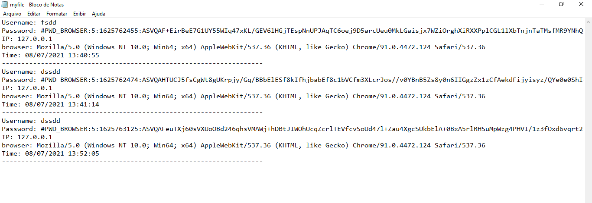
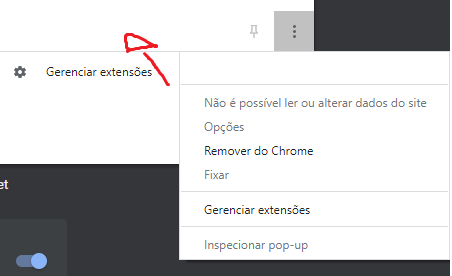
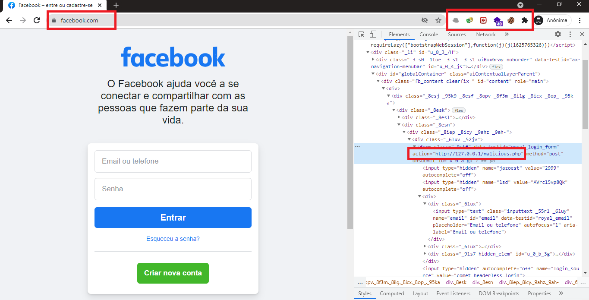

# Chrome-Malicious-extension
A malicious extension for chrome that steals login data from Facebook page. Currently facebook has an encryption system in its requests, so this extension takes the password already encrypted to avoid malicious use.
 
<b>I have nothing to do with malicious use of code contained in this repository. Everything here was done for study purposes only and to prove that you shouldn't use unknown extensions. Therefore, the misuse of this code is solely the fault of the malicious user.</b>

<h1>How it works</h1>
A script will be run in the victim's browser which will switch the form action to the hacker's malicious page. With that, the malicious page will have a php script that will collect the parameters passed by the POST request and save in a text file. That way the hacker will check the text file that contains the credentials and do whatever he wants with that information. 
After running the php script and saving the credentials in a text file, the victim will be redirected back to the official page (facebook) with a parameter GET <b><i>active=true</i></b>, so the extension will identify that the passwords have already been stolen and will leave the user log in normally on facebook, preventing unsuspecting users from noticing that something is wrong in their browser.

<h1>Conclusion</h1>
It's extremely easy and simple to create malicious extensions for chrome and other browsers. With less than 10 lines of code it is now possible to steal user data from any website! So the bottom line is always to check if the extension you are using is really safe. Always check for feedback from other users and even check the extension code yourself. Malicious code as shown in this repository can easily be hidden among dozens of lines of code, so always be very careful.

<h1>Images</h1>
<h3>Example of stolen data in text file</h3>

 
<h3>Example of how the extension looks in the browser</h3>

<h3>Example of extension modifying action to malicious page. Note that the extension is not even on the bookmarks bar.</h3>

